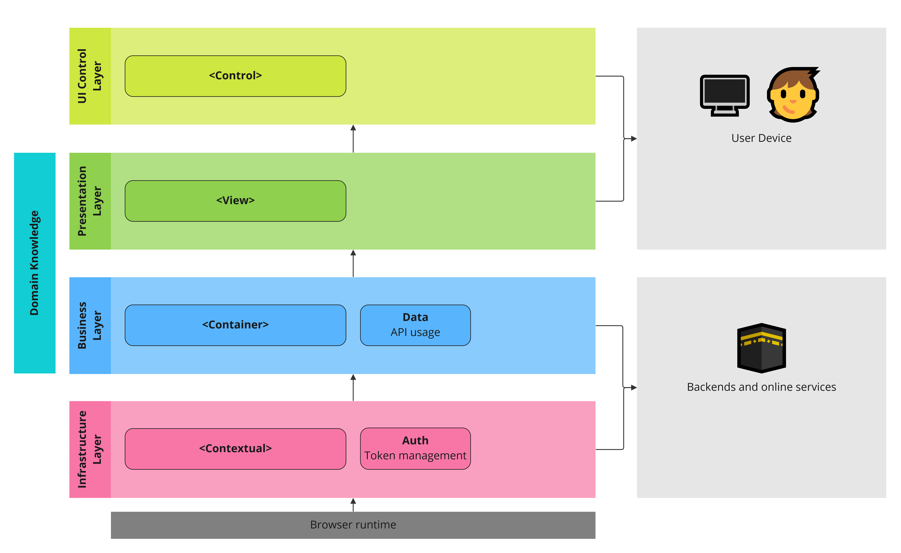
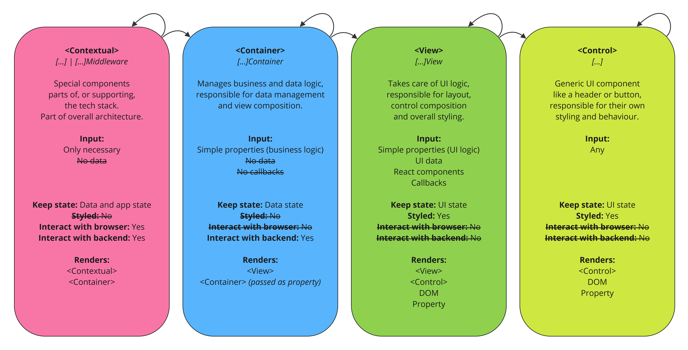
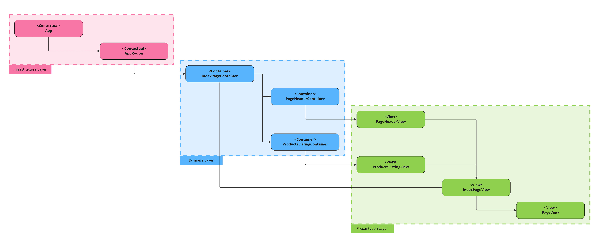

# New LK
# (To be updated)

## Local Development

### Pre-Requisites

- [NodeJS](https://nodejs.org/en)
- [Yarn 1.*](https://classic.yarnpkg.com/lang/en/)

### Commands

```sh
# Install Dependencies
yarn

# Serve during development
yarn serve
# -> http://localhost:1234/

# Compile with TypeScript
yarn compile

# Run (Unit) Tests
yarn test

# Format Files
yarn fmt
```

## Architecure

### Layers

The suggested architecture is based upon four main layers.



- **Infrastructur Layer**
  Responsible for bootstrapping the application, as well as all higher-order knowledge of the application as a whole.
- **Business Layer**
  With deep domain knowledge, this layer is responsible for the data and operations on the data.
- **Presentation Layer**
  With domain knowledge, this layer is responsible for what appears on the screen and how the user interacts with it.
- **UI Control Layer**
  Keeps no understanding of the domain context, but provide the common building blocks used by the Presentation Layer.

Each layer maps to a dedicated React Component role:


In practice, this architecture leads to a render graph where the layers is still clearly visible and operational:


## Stack

- [React](https://react.dev/)
- [TypeScript](https://www.typescriptlang.org/docs/handbook/intro.html#get-started)
- [SWR](https://swr.vercel.app/) for data fetching
- [Wouter](https://github.com/molefrog/wouter) for routing
- [Jest](https://jestjs.io/) as unit test runner
- [React Testing Library](https://testing-library.com/docs/react-testing-library/intro/) for React component tests
- [Parcel](https://parceljs.org/) for bundling and development runtime

## PoC

- [DummyJSON](https://dummyjson.com/) to be able to interact with an API.
